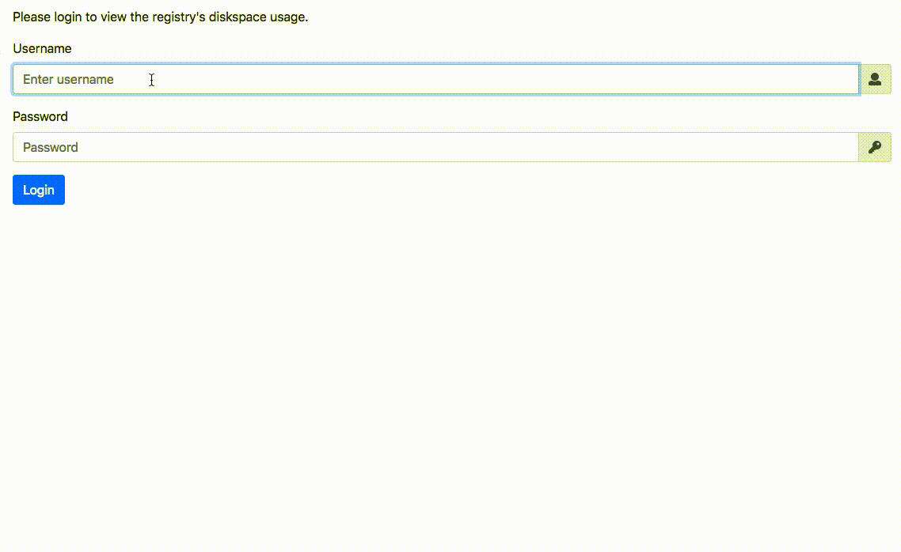

# Gitlab Registry Usage Frontend

A JavaScript frontend for [Gitlab Registry Usage REST](https://github.com/sciapp/gitlab-registry-usage-rest).
It requests image information for every used image and displays it using colored progressbars.

Gitlab Registry Usage Frontend uses the following libraries, imported via CDN:

  * Bootstrap 4.0.0 (`css` and `js`)
  * popper.js 1.12.9
  * jQuery 3.3.1
  * Fontawesome v5.0.8


## Demo

 

## Configuration

Replace the example URLs in `gitlabRegistryUsage.js` by your server's URL's.
`SERVER_URL` is used to request the image data, `LOGIN_URL` is used to request an authorization token.

```JavaScript
// Replace the following URLs
//---------------------------------------------------------------------------------------------
const SERVER_URL = `https://exampleserver/gitlab-registry-usage-rest/images?embed=true`;
const LOGIN_URL = `https://exampleserver/gitlab-registry-usage-rest/auth_token`;
//---------------------------------------------------------------------------------------------
```

You can also change the lifetime of the cookie that stores the authorization token. The default value is 14 days

```JavaScript
const COOKIE_LIFETIME = 1000 * 60 * 60 * 24 * 14;   //Cookie lifetime (14 days)
```